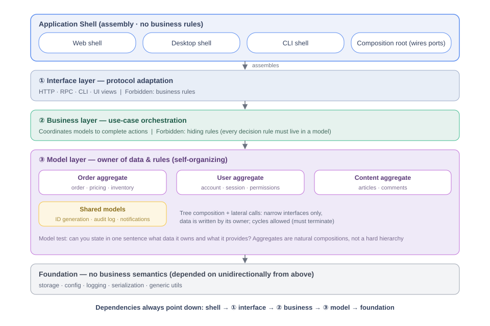
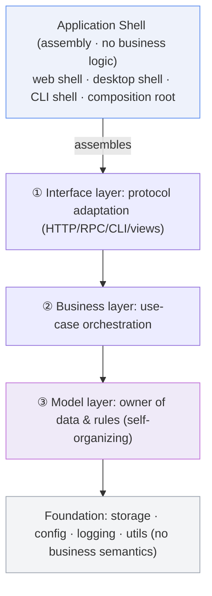
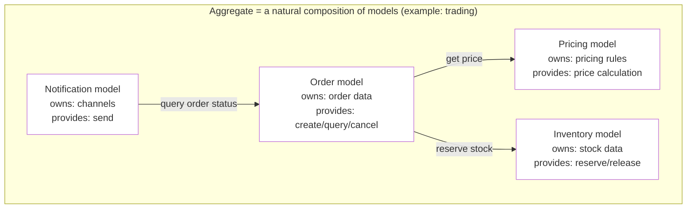
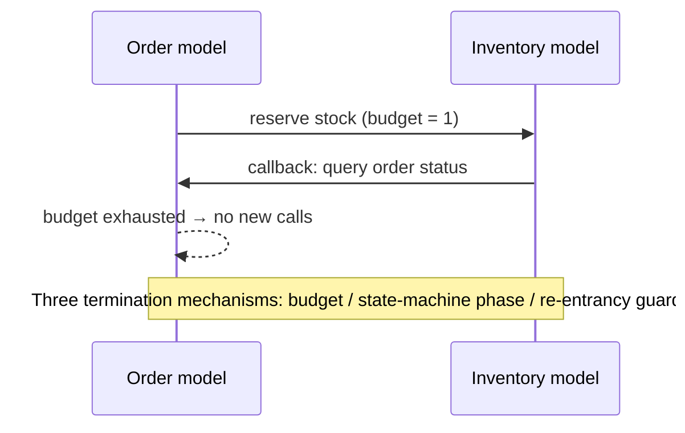

# Model-Self-Organizing Architecture (MSO)

English | [简体中文](README.zh-CN.md)

> The **model** as the smallest self-contained unit: each model owns its data, carries its own rules, and exposes only a narrow interface. The model layer self-organizes — tree composition, lateral calls, and cycles are all allowed, as long as every cycle terminates. Above the model layer there are only two jobs: adapt protocols and orchestrate use cases.



## At a Glance



**Dependencies always point down — never up.** The shell contains no business logic; it only decides which runnable application the three layers get assembled into (process & entry form).

Two terms used above: **port** = the narrow interface a model/aggregate exposes; **composition root** = the single place where ports are wired into their consumers.

## Layer Responsibilities

| Layer | Does only | Must not |
|---|---|---|
| ① Interface layer | Protocol adaptation: translate HTTP/RPC/CLI into business-layer calls | Contain any business rule |
| ② Business layer | Use-case orchestration: coordinate models to complete an action | Hide rules (every decision rule must live in a model) |
| ③ Model layer | Own data and rules; expose only narrow interfaces | Touch other models' internal state directly |

**Foundation** (below the three layers): business-agnostic infrastructure — storage access, configuration, logging, serialization, generic utilities.
Test: read its code and you will **hear no business vocabulary**; it works unchanged in a different project. The model layer carries business rules (how to price); the foundation only carries mechanics (how to store, how to log). Cross-domain reuse *with* rules is a "shared model" — not the foundation.

## The Model: Smallest Self-Contained Unit

**Definition**: owns its data + carries its rules + narrow API.
**Test**: can you state in one sentence what data it owns and what operations it provides? If not, the split isn't clear yet.



Key points:
- **Aggregates are not a hard hierarchy** — they are natural compositions of models, doubling as file-organization and code-review boundaries
- **Lateral calls are normal** — the order model asks pricing, notifications ask orders, always through the other side's public API
- **Data is owned by its writer** — to read another model's data, call its interface; never reach into its internals

## Granularity Is Fractal: A Microservice Is a Bigger Model

The same rules hold at every scale — model → aggregate → process/microservice are the same idea at different sizes. **A microservice is just a larger-grained model**: it owns its database (data ownership), exposes HTTP/gRPC (narrow API), and relies on timeouts/budgets/circuit breakers to guarantee calls terminate.

| Scale | Data ownership | Narrow API | Termination guarantee |
|---|---|---|---|
| Model (in-package) | owns its struct / tables | method interface | re-entrancy guard / call budget |
| Aggregate (file group) | owns its directory / table domain | composition-root-wired port | state-machine phase |
| Microservice (process) | owns its database (no shared DB) | HTTP / gRPC / messaging | timeout / retry budget / circuit breaker |

## Cycles Are Allowed — But Must Stop

A calls B and B calls back into A: legal. The single condition: **every cycle must have a termination guarantee**.



**Host-language note**: Go rejects package-level import cycles at compile time. So models start as file groups inside one package (mutual calls, cycles included, are natural); when promoting to real packages later, models on a cycle either merge into one package or the cycle gets cut with an interface wired by the composition root — a mechanical step, not a design obstacle.

## Core Disciplines (Only Three; process discipline during adoption is covered in "Incremental Adoption")

1. **Cycles are allowed, but every cycle needs a termination guarantee** (budget / phase / re-entrancy guard) plus a test proving it stops
2. **Narrow API + data ownership** — lateral calls go through the other side's public operations only; data is written by its owner
3. **No rules hidden in the business layer** — decisions like "who may do X" must live in some model

## Relation to Established Architectures

| This architecture | Established counterpart |
|---|---|
| Model (smallest self-contained unit) | DDD Aggregate + data ownership (share nothing) |
| Aggregate (natural composition) | Bounded Context — note: here "aggregate" means a grouping of models, not DDD's Aggregate |
| Three layers + downward dependencies | Dependency rule of Clean / Onion / Hexagonal Architecture |
| Narrow interfaces + composition root | Ports & Adapters |
| The whole | **Modular Monolith** |
| **Distinctive point** | **Runtime termination guarantees** replace static acyclicity (DAG) constraints |

## When to Use It — and When Not

**Good fit**: a monolith with multiple business capabilities; legacy systems where modules drag each other down (fix one, break another); boundary governance between microservices (each service = a bigger model, see "Granularity Is Fractal").

**Poor fit**: tiny tools of one or two files — below model granularity, this structure is pure overhead.

## Incremental Adoption (behavior-freezing refactor)

```
Step 0  Inventory: four lenses (data ownership / rule invariants /
        life cycles / use-case flows) to find "ownerless" data and rules
        → 100% file→model mapping
Step 1  Document: write a contract per model (what it owns, provides,
        whom it may call)
Step 2  In-package file groups: group files by model — no new packages,
        no cross-package moves
Step 3  Promote to real packages: models on a cycle merge into one
        package or cut the cycle with an interface
```

Run the full test suite at every step; move on only when it's green.

## Make Your AI Use This Architecture

**Send this to your AI**:

```text
Please apply the architecture at https://github.com/zly-app/mso-arch:
read its AGENTS.md (Model-Self-Organizing Architecture, MSO) and follow
its rules and review checklist for all design, coding, and reviews in
my project.
```

If your AI cannot access the web: copy `AGENTS.md` into your repository root (most AI coding assistants read it automatically), or paste its full text into the conversation.

After adoption, have the AI record the source link in your project's AI rules file — see **Adoption & Provenance** in `AGENTS.md` — so future sessions always read the canonical rules.

## Directory

```
README.md            for humans (this file)
README.zh-CN.md      简体中文版
AGENTS.md            for AI (precise rules + review checklist + anti-patterns)
AGENTS.zh-CN.md      AI 协作规则（中文版）
assets/overview.svg  overview diagram
LICENSE              MIT (attribution required, otherwise free use)
```
