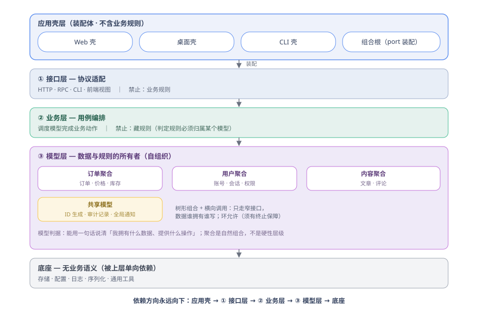
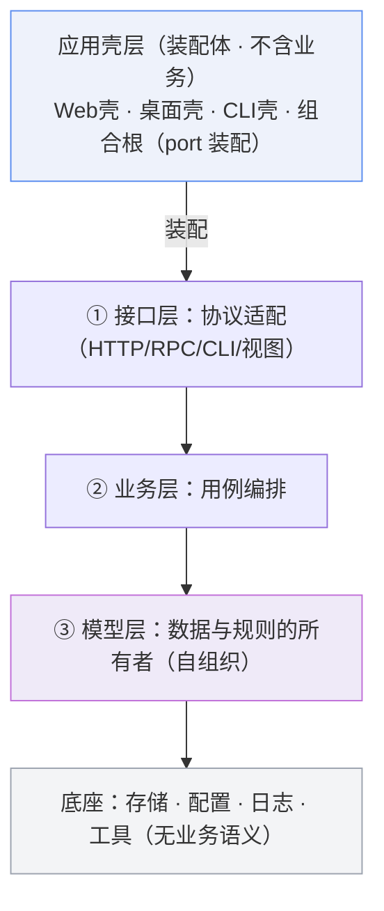
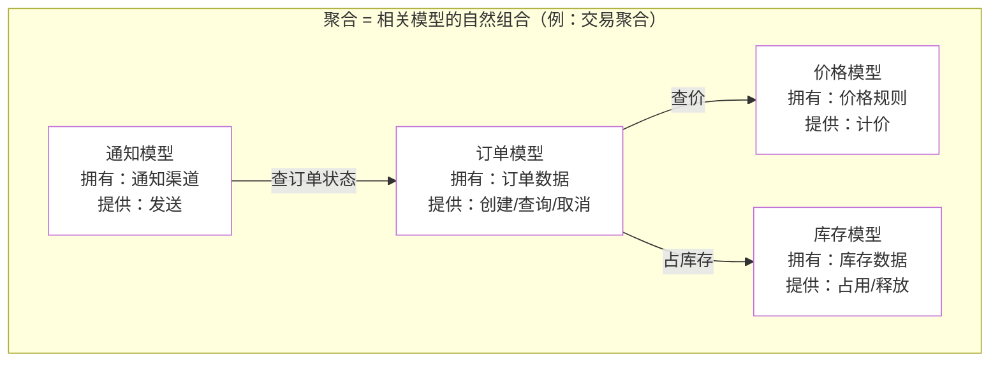
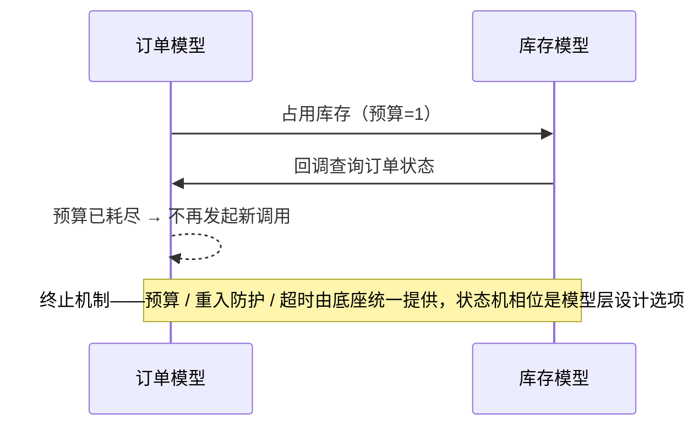

# 模型自组织架构

**Model-Self-Organizing Architecture（MSO）**

简体中文 | [English](README.md)

> 以「模型」为最小自闭环单元：每个模型独占自己的数据、自带规则、只暴露窄接口。
> 模型层自组织——树形组合、允许横向调用、允许有终止保障的环。上层只有两件事：适配协议、编排用例。



## 一图看懂



**依赖方向永远向下，不许反向。** 应用壳不含业务，只决定三层被装进哪个可运行的应用（进程与入口形态）。
两个图中术语：**port** = 模型/聚合对外的窄接口；**组合根** = 唯一的装配点（把 port 注入使用者）。

## 分层职责（三层各自只做一件事）

| 层 | 只做 | 禁止 |
|---|---|---|
| ① 接口层 | 协议适配：把 HTTP/RPC/CLI 翻译成对业务层的调用 | 出现任何业务规则 |
| ② 业务层 | 用例编排：调度几个模型完成一个动作 | 藏规则（判定规则必须归属某个模型） |
| ③ 模型层 | 拥有数据与规则，对外只暴露窄接口 | 直接读写别的模型的内部数据 |

**底座**（三层之下）：无业务语义的基础设施——存储访问、配置、日志、序列化、通用工具。
判据：读它的代码**听不到任何业务名词**，换个项目它原样能用。模型层带业务规则（怎么计价），底座只有机制（怎么存、怎么记日志）；跨领域复用但带规则的是「共享模型」，与底座是两回事。能力长出第二个使用方时必须做「搬家判断」：带业务规则 → 共享模型；纯机制、无规则 → 底座。

## 模型：最小自闭环单元

**定义**：独占数据 + 自带规则 + 窄 API。
**判据**：能用一句话说清「我拥有什么数据、提供什么操作」。说不清，就还没想清楚怎么拆。



要点：
- **聚合不是硬性层级**——它是模型的自然组合，同时充当文件组织与代码评审的边界
- **横向调用是常态**——订单查价格、通知查订单，都走对方公开 API
- **数据谁拥有谁写**——想读别人的数据，只能调它的接口，不许翻内部状态

## 粒度是分形的：微服务 = 更大粒度的模型

同一套规则在任意粒度成立——模型 → 聚合 → 进程/微服务，是同一思想的不同尺度。**一个微服务就是一个更大粒度的模型**：独占自己的数据库（数据独占）、暴露 HTTP/gRPC 接口（窄 API）、靠超时/预算/熔断保证调用会停（终止保障）。

| 粒度 | 数据独占 | 窄 API | 终止保障 |
|---|---|---|---|
| 模型（包内） | 独占 struct / 数据表 | 方法接口 | 重入防护 / 调用预算 |
| 聚合（文件组） | 独占目录 / 表域 | 组合根注入的 port | 状态机相位 |
| 微服务（进程） | 独占数据库（禁共享库） | HTTP / gRPC / 消息 | 超时 / 重试预算 / 熔断 |

表格列的是各粒度适用的机制，不是实现方：重入防护与调用预算由底座实现，状态机相位是在模型契约中声明的设计选项。

## 环：允许，但必须会停

A 调 B、B 又调 A，是合法的。条件只有一条：**这条环必须有终止保障**。



终止保障由底座统一提供（预算 / 重入防护 / 超时），模型不自建私有版本——各写各的私有机制会互相不知情、质量参差。

**宿主语言注意**：Go 的包级 import 环是编译错误。所以模型先以「同包文件组」形态存在（天然允许互调成环）；将来拆独立包时，环上的模型要么合并成一个包，要么在环上切一刀换成接口、由组合根装配——这是机械动作，不是设计障碍。

## 横切上下文：无主信息的正路

有一类信息不属于任何模型，但整条链路都要用：用户身份、租户、链路追踪号、语言/时区。它像进园区领的工牌——一次登记，各楼刷证通行，不必每栋楼重新验明身份。

它没有归属模型，两条老路都走不通：存全局变量违反「数据独占」；每个方法加参数层层传违反「窄 API」。唯一正路：

- **底座隐式传播 + 统一 API 显式读取**——业务代码不经手、不改签名
- **没有上下文的流程（定时任务、批处理）必须显式声明**，并处理「取不到」的分支——禁止把「取不到」当成「不限制」

## 核心纪律（仅此三条；落地时另有流程纪律，见「在存量代码中落地」）

1. **环允许，但每条环必须有终止保障**（预算 / 重入防护 / 超时由底座统一提供；状态机相位是模型层设计选项），并有「会停」的测试
2. **窄 API + 数据独占**——横向调用只走对方公开操作，数据谁拥有谁写
3. **业务层不藏规则**——「谁能做X」这类判定必须归属某个模型

> 纪律的落地靠机检不靠自觉：可机检的子集（依赖方向、接口签名、环检测）应由 CI 静态检查拦截，评审清单只兜语义层。

## 与业界架构的关系

| 本架构概念 | 业界对应 |
|---|---|
| 模型（最小自闭环单元） | DDD 聚合（Aggregate）+ 数据所有权（share nothing） |
| 聚合（自然组合） | 限界上下文（Bounded Context）——注意：本架构的「聚合」是模型分组，不是 DDD 的 Aggregate |
| 三层 + 依赖向下 | 整洁架构 / 洋葱架构 / 六边形架构的依赖规则 |
| 窄接口 + 组合根注入 | 端口与适配器（Ports & Adapters） |
| 整体 | **模块化单体（Modular Monolith）** |
| **独特点** | 用**运行期终止保障**替代静态无环（DAG）约束 |

## 何时用 / 何时不用

**适合**：单体内多业务能力；模块间互相牵连、改一处坏一片的存量系统；微服务之间的边界治理（每个服务 = 更大粒度的模型，见「粒度是分形的」）。

**不适合**：一两个文件的小工具——粒度小于「模型」时，这套结构是纯开销。

## 在存量代码中落地（渐进式，行为零变化）

```
第 0 步  盘点：四透镜（数据所有权 / 规则不变量 / 生命周期 / 流程用例）
         找出「无主」的数据与规则 → 100% 文件→模型映射
第 1 步  文档化：每个模型写契约（拥有什么、提供什么、允许调用谁）
第 2 步  包内文件组：按模型归组文件，不建新包、不搬跨包
第 3 步  提真包：把文件组提升为独立包；环上模型合并成包或切刀换接口
```

每步跑全量测试，全绿才进下一步。

补充纪律：未结构化的存量（无分层、大文件平铺）契约文档先行，归组只在需求自然触碰时进行——禁止为「符合架构」立项专项重构。

## 如何让你的 AI 使用这套架构

**将以下内容发给你的 AI**：

```text
请采用 https://github.com/zly-app/mso-arch 的模型自组织架构（MSO）：
阅读其 README.md 与 AGENTS.md，并执行 AGENTS.md「采用与溯源」中的安装流程。
```

提示词刻意保持简短——具体安装步骤写在 `AGENTS.md` 的「采用与溯源」里，由 AI 从仓库读取后执行。简述：AI 会把规则一次性复制进项目（`docs/mso/AGENTS.md`，与项目语言一致），并在根 AI 规则文件留下三行引用；此后每个会话读本地副本，不再重复联网下载。

如果你的 AI 不能联网：手动把与项目语言一致的规则文件复制到 `docs/mso/AGENTS.md`，并按「采用与溯源」把引用块加进根 `AGENTS.md`。

## 目录

```
README.md            英文主文档
README.zh-CN.md      简体中文（本文）
AGENTS.md            给 AI 看（英文 · 精确规则 + 评审清单 + 反模式）
AGENTS.zh-CN.md      AI 协作规则（中文版）
assets/overview.svg        总图（英文）
assets/overview.zh-CN.svg  总图（中文）
LICENSE              MIT（保留署名，其余自由使用）
```
